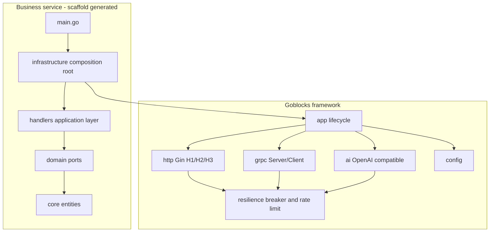
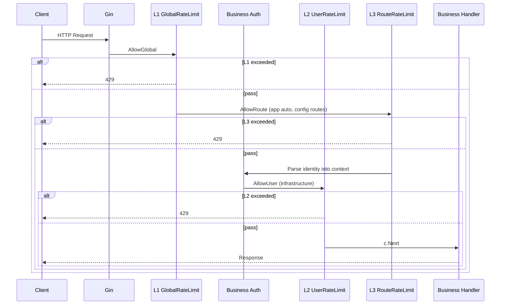

# Architecture

## Overview

Goblocks consists of the **framework library** ([goblocks](https://github.com/ymhhh/goblocks)), the **scaffold CLI** ([goblocks-cli](https://github.com/ymhhh/goblocks-cli)), and **business services** (generated by the CLI).



## Onion architecture (generated projects)

Aligned with [ddd-onion-sample](https://github.com/ymhhh/ddd-onion-sample):

| Layer | Directory | Responsibility | Dependencies |
|-------|-----------|----------------|--------------|
| Entities | `core/` | Domain entities, value objects | None |
| Ports | `domain/` | Repository interfaces, domain errors | `core` |
| Application | `handlers/` | Use-case orchestration, DTO mapping | `domain` |
| Adapters | `infrastructure/` | DI, route registration, bootstrap | `handlers` + goblocks |

**Dependency rules (must follow):**

```
handlers → domain → core
infrastructure → handlers + goblocks
main → infrastructure (bootstrap only)
```

`core` and `domain` must not import `handlers`, `infrastructure`, or goblocks packages.

## Framework package layout

```
goblocks/
├── config/       YAML loading, GOBLOCKS_* env overrides
├── resilience/   Breaker + RateLimiter (memory/redis) + Policy
├── http/         Gin wrapper, H2 over TLS, optional H3 (QUIC)
│   └── middleware/  L1/L2/L3 HTTP rate limits and BreakerCheck
├── grpc/         gRPC Server/Client
│   └── interceptors/  L1/L2/L3 unary interceptors
├── ai/           OpenAI-compatible Chat client
├── metrics/      Prometheus metrics (scope label)
├── app/          Startup, signals, graceful shutdown (L1 + L3 by default)
└── docs/         Documentation
```

The scaffold CLI lives in [goblocks-cli](https://github.com/ymhhh/goblocks-cli) (`cmd/goblocks` + `internal/scaffold`).

## Request flow

### Inbound HTTP



`app.Run` mounts **L1 + breaker + L3 (when `routes` is configured)** by default; L2 is mounted in `infrastructure/registerHTTP` after authentication.

## Layered rate limiting: layout and responsibilities

Rate limiting spans the **framework layer** (this repo) and the **business layer** (scaffold `infrastructure/`). The framework mounts L1 and L3 (config-driven) by default; L2 requires business auth wiring.

### Framework (goblocks)

| Layer | Purpose | Redis/Memory key | Package / file | Default mount |
|-------|---------|------------------|----------------|---------------|
| **L1 Global** | Protect service/cluster | `global` or `global:{service}` | `resilience/` + `http/middleware/ratelimit.go` (`GlobalRateLimit`) + `grpc/interceptors/resilience.go` (`UnaryServerInterceptor`) | **Yes** (`app.Run`) |
| **L2 User** | Fair per-user quota | `user:{userId}` | Same + `resilience/keyed.go` (`UserRateLimit` / `UserUnaryServerInterceptor`) | No |
| **L3 Route** | Expensive API control | `route:{METHOD}:{path}` | Same (`RouteRateLimit` / `RouteUnaryServerInterceptor`) | **Yes** (when config has `routes`) |

```
goblocks/
├── config/config.go              rate_limit schema (global / user / routes / backend)
├── resilience/
│   ├── ratelimiter.go            RateLimiter interface, Scope, LimitRule
│   ├── memory_ratelimiter.go     In-memory backend (dev/tests)
│   ├── redis_ratelimiter.go      Redis backend (GCRA, multi-Pod)
│   ├── keyed.go                  GlobalKey / UserKeyFromContext / RouteKey
│   ├── factory.go                NewRateLimiterBackend, BuildRateLimitRules
│   └── policy.go                 AllowGlobal / AllowUser / AllowRoute
├── http/middleware/ratelimit.go  HTTP middleware (L1/L2/L3 + BreakerCheck)
├── grpc/interceptors/resilience.go  gRPC interceptors
├── metrics/registry.go           rate_limit_rejected_total{protocol, scope}
└── app/app.go                    L1 + Breaker + L3 (when config routes)
```

**Logic that should not live in the framework:**

- JWT / API Key parsing → business `infrastructure` auth middleware
- Per-API business QPS policy → business route registration or YAML `routes` (framework only parses)

### Business project (scaffold generated)

| Directory | Rate-limit responsibility |
|-----------|-------------------------|
| `infrastructure/run.go` | In `registerHTTP`: auth → `UserRateLimit` (L2); L3 driven by config `routes`, mounted by `app` |
| `handlers/` | Pass userId via context; do **not** call `Allow()` manually |
| `domain/` / `core/` | Do **not** import HTTP, goblocks, or rate-limit code |

The Demo template (`--demo`) demonstrates **L2** on `/users/:id`; **L3** is configured in `config.yaml` `routes` and applied automatically by `app`. See the [rate-limiting guide (中文)](zh/rate-limiting.md).

### Middleware order (HTTP)

```
Recovery → Metrics → Tracing → L1 Global → BreakerCheck → L3 Route → [Business Auth] → L2 User → Handler
                              ↑ app default (L3 needs config routes)  ↑ infrastructure
```

### Inbound gRPC

`UnaryServerInterceptor` provides **L1 global rate limit + breaker**; when config has `routes`, `RouteUnaryServerInterceptor` is chained automatically; `UserUnaryServerInterceptor` is added in infrastructure. User identity is injected via metadata `x-user-id`.

### Outbound AI

`ai.Client.Chat()` runs: rate limit check → breaker wrap → HTTP call to OpenAI-compatible API.

## Lifecycle

`app.App.Run(ctx)` order:

1. Load config, create shared `resilience.Policy`
2. Build Gin engine, register HTTP routes, start HTTP/HTTPS (and optional H3)
3. If `server.grpc.enabled`, register gRPC services and listen
4. Block on `SIGINT` / `SIGTERM`
5. Graceful shutdown of HTTP and gRPC within 30 seconds

## Design principles

- **Explicit dependency injection**: composition root (`infrastructure`) constructs dependencies; no reflection container
- **Unified Policy**: HTTP, gRPC, and AI share the same breaker/rate-limit config
- **Optional protocols**: HTTP/3, gRPC, and AI can be disabled via config
- **Scaffold vs framework separation**: generated projects reference goblocks via go module; business code does not modify framework source
