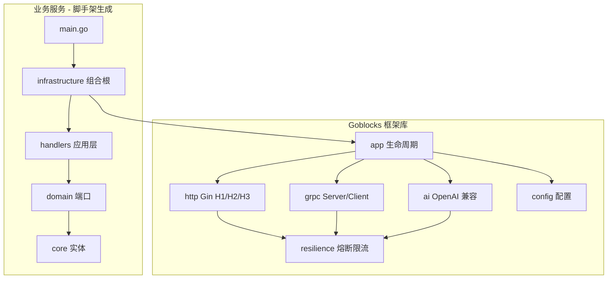
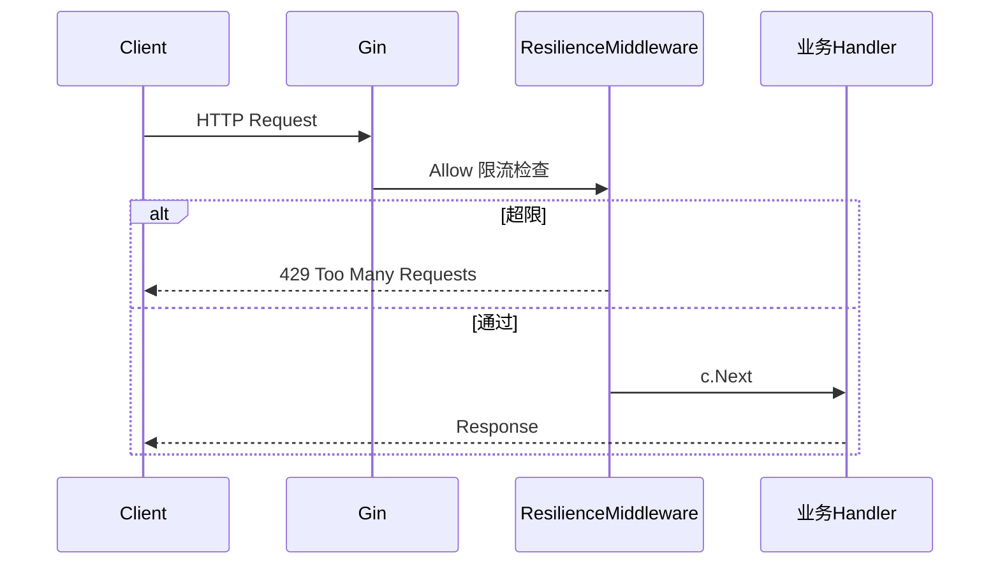

# 架构设计

## 总体分层

Goblocks 分为两层：**框架库**（本仓库 [goblocks](https://github.com/ymhhh/goblocks)）与 **脚手架 CLI**（[goblocks-cli](https://github.com/ymhhh/goblocks-cli)），以及 **业务服务**（CLI 生成）。



## 洋葱架构（生成工程）

与 [ddd-onion-sample](https://github.com/ymhhh/ddd-onion-sample) 对齐：

| 层 | 目录 | 职责 | 依赖 |
|----|------|------|------|
| 实体 | `core/` | 领域实体、值对象 | 无外部依赖 |
| 端口 | `domain/` | 仓储接口、领域错误 | `core` |
| 应用 | `handlers/` | 用例编排、DTO 转换 | `domain` |
| 适配 | `infrastructure/` | DI、路由注册、启动 | `handlers` + goblocks |

**依赖规则（必须遵守）：**

```
handlers → domain → core
infrastructure → handlers + goblocks
main → infrastructure（仅引导启动）
```

`core` 和 `domain` 不得 import `handlers`、`infrastructure` 或 goblocks 框架包。

## 框架库包职责

```
goblocks/
├── config/       加载 YAML，支持 GOBLOCKS_* 环境变量
├── resilience/   熔断（gobreaker）+ 限流（token bucket）+ Policy 组合
├── http/         Gin 封装，TLS 下 H2，可选 H3（QUIC）
├── grpc/         gRPC Server/Client + Interceptor
├── ai/           OpenAI 兼容 Chat Client
├── metrics/      Prometheus 观测指标
├── app/          统一启动、信号处理、优雅关闭
└── docs/         说明文档
```

脚手架 CLI 位于独立仓库 [goblocks-cli](https://github.com/ymhhh/goblocks-cli)（`cmd/goblocks` + `internal/scaffold`）。

## 请求流转

### HTTP 入站



### gRPC 入站

Unary Server Interceptor 在 handler 执行前调用 `Policy.Allow()`，执行时经 `Policy.Execute()` 包裹，超限返回 `ResourceExhausted`，熔断打开返回 `Unavailable`。

### AI 出站

`ai.Client.Chat()` 内部依次：限流检查 → 熔断包裹 → HTTP 调用 OpenAI 兼容 API。

## 生命周期

`app.App.Run(ctx)` 执行顺序：

1. 加载配置，创建共享 `resilience.Policy`
2. 构建 Gin Engine，注册 HTTP 路由，启动 HTTP/HTTPS（及可选 H3）
3. 若 `server.grpc.enabled`，注册 gRPC 服务并监听
4. 阻塞等待 `SIGINT` / `SIGTERM`
5. 30 秒内优雅关闭 HTTP 与 gRPC

## 设计原则

- **显式依赖注入**：组合根（`infrastructure`）负责构造，不使用反射容器
- **统一 Policy**：HTTP、gRPC、AI 共用同一套熔断/限流配置
- **协议可选**：HTTP/3、gRPC、AI 均可通过配置关闭
- **脚手架与框架分离**：生成工程通过 go module 引用 goblocks，业务代码不侵入框架源码
