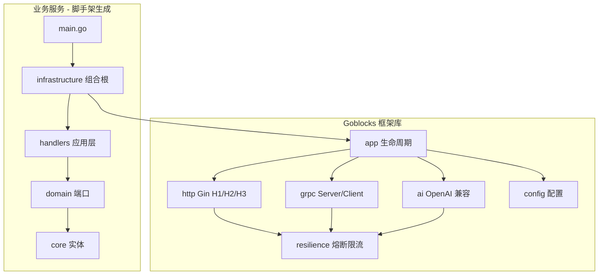
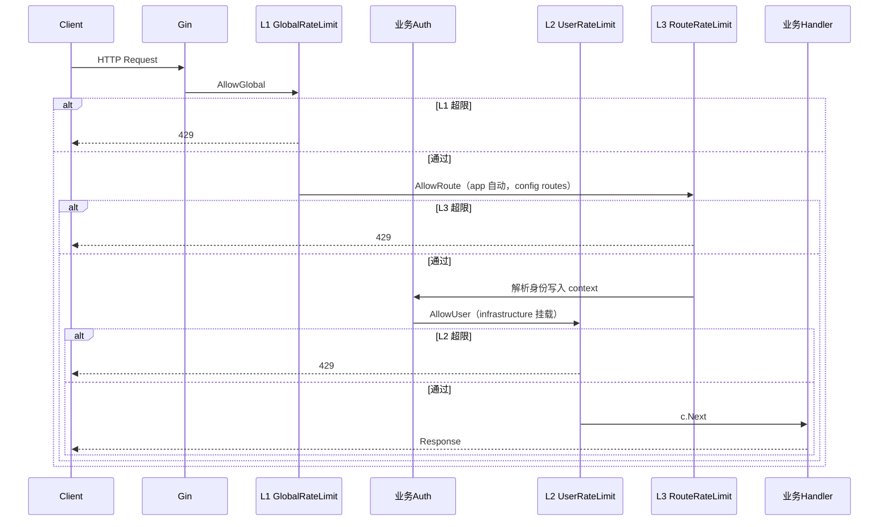

# 架构设计

## 总体分层

Goblocks 由 **框架库**（[goblocks](https://github.com/ymhhh/goblocks)）、**脚手架 CLI**（[goblocks-cli](https://github.com/ymhhh/goblocks-cli)）以及 **业务服务**（CLI 生成）组成。



## 洋葱架构（生成工程）

与 [ddd-onion-sample](https://github.com/ymhhh/ddd-onion-sample) 对齐：

| 层 | 目录 | 职责 | 依赖 |
|----|------|------|------|
| 实体 | `core/` | 领域实体、值对象 | 无外部依赖 |
| 端口 | `domain/` | 仓储接口、领域错误 | `core` |
| 应用 | `handlers/` | 用例编排、DTO 转换 | `domain` |
| 适配 | `infrastructure/` | DI、路由注册、启动 | `handlers` + goblocks |

**依赖规则（必须遵守）：**

```
handlers → domain → core
infrastructure → handlers + goblocks
main → infrastructure（仅引导启动）
```

`core` 和 `domain` 不得 import `handlers`、`infrastructure` 或 goblocks 框架包。

## 框架库包职责

```
goblocks/
├── config/       加载 YAML，支持 GOBLOCKS_* 环境变量
├── resilience/   熔断 + RateLimiter（memory/redis）+ Policy
├── http/         Gin 封装，TLS 下 H2，可选 H3（QUIC）
│   └── middleware/  L1/L2/L3 HTTP 限流与 BreakerCheck
├── grpc/         gRPC Server/Client
│   └── interceptors/  L1/L2/L3 unary interceptors
├── ai/           OpenAI 兼容 Chat Client
├── metrics/      Prometheus 观测指标（含 scope label）
├── app/          统一启动、信号处理、优雅关闭（默认 L1 + L3）
└── docs/         说明文档
```

脚手架 CLI 位于 [goblocks-cli](https://github.com/ymhhh/goblocks-cli)（`cmd/goblocks` + `internal/scaffold`）。

## 请求流转

### HTTP 入站



`app.Run` 默认挂载 **L1 + 熔断 + L3（config 配置了 `routes` 时）**；L2 由 `infrastructure/registerHTTP` 在鉴权之后挂载。

## 分层限流：目录与职责

限流分 **框架层**（本仓库）与 **业务层**（脚手架 `infrastructure/`）。框架默认挂载 L1 与 L3（配置驱动）；L2 需业务鉴权后挂载。

### 框架库（goblocks）

| 限流层 | 目的 | Redis/Memory key | 包 / 文件 | 默认挂载 |
|--------|------|------------------|-----------|----------|
| **L1 全局** | 保护服务/集群 | `global` 或 `global:{service}` | `resilience/` + `http/middleware/ratelimit.go` + `grpc/interceptors/resilience.go` | **是**（`app.Run`） |
| **L2 用户** | 公平配额 | `user:{userId}` | 同上 + `resilience/keyed.go` | 否 |
| **L3 路由** | 昂贵 API 控流 | `route:{METHOD}:{path}` | 同上（`RouteRateLimit` / `RouteUnaryServerInterceptor`） | **是**（config 有 `routes` 时） |

**不应放在框架层的逻辑：**

- JWT / API Key 解析 → 业务 `infrastructure` 鉴权中间件
- 各 API 的业务 QPS 策略 → YAML `routes` 或业务路由注册（框架只解析）

### 业务工程（脚手架生成）

| 目录 | 限流相关职责 |
|------|--------------|
| `infrastructure/run.go` | 鉴权 → `UserRateLimit`（L2）；L3 由 config `routes` 驱动，`app` 自动挂载 |
| `handlers/` | 通过 context 传递 userId；**不**手写 `Allow()` |
| `domain/` / `core/` | **不** import HTTP、goblocks、限流 |

Demo 模板（`--demo`）在 `/users/:id` 演示 **L2**；**L3** 见 [分层限流指南](rate-limiting.md)。

### 中间件顺序（HTTP）

```
Recovery → Metrics → Tracing → L1 Global → BreakerCheck → L3 Route → [业务 Auth] → L2 User → Handler
                              ↑ app 默认（L3 需 config routes）    ↑ infrastructure
```

### gRPC 入站

`UnaryServerInterceptor` 提供 **L1 全局限流 + 熔断**；config 有 `routes` 时自动链式挂载 `RouteUnaryServerInterceptor`；`UserUnaryServerInterceptor` 由 infrastructure 追加。用户身份通过 metadata `x-user-id` 注入。

### AI 出站

`ai.Client.Chat()` 内部依次：限流检查 → 熔断包裹 → HTTP 调用 OpenAI 兼容 API。

## 生命周期

`app.App.Run(ctx)` 执行顺序：

1. 加载配置，创建共享 `resilience.Policy`
2. 构建 Gin Engine，注册 HTTP 路由，启动 HTTP/HTTPS（及可选 H3）
3. 若 `server.grpc.enabled`，注册 gRPC 服务并监听
4. 阻塞等待 `SIGINT` / `SIGTERM`
5. 30 秒内优雅关闭 HTTP 与 gRPC

## 设计原则

- **显式依赖注入**：组合根（`infrastructure`）负责构造，不使用反射容器
- **统一 Policy**：HTTP、gRPC、AI 共用同一套熔断/限流配置
- **协议可选**：HTTP/3、gRPC、AI 均可通过配置关闭
- **脚手架与框架分离**：生成工程通过 go module 引用 goblocks，业务代码不侵入框架源码
